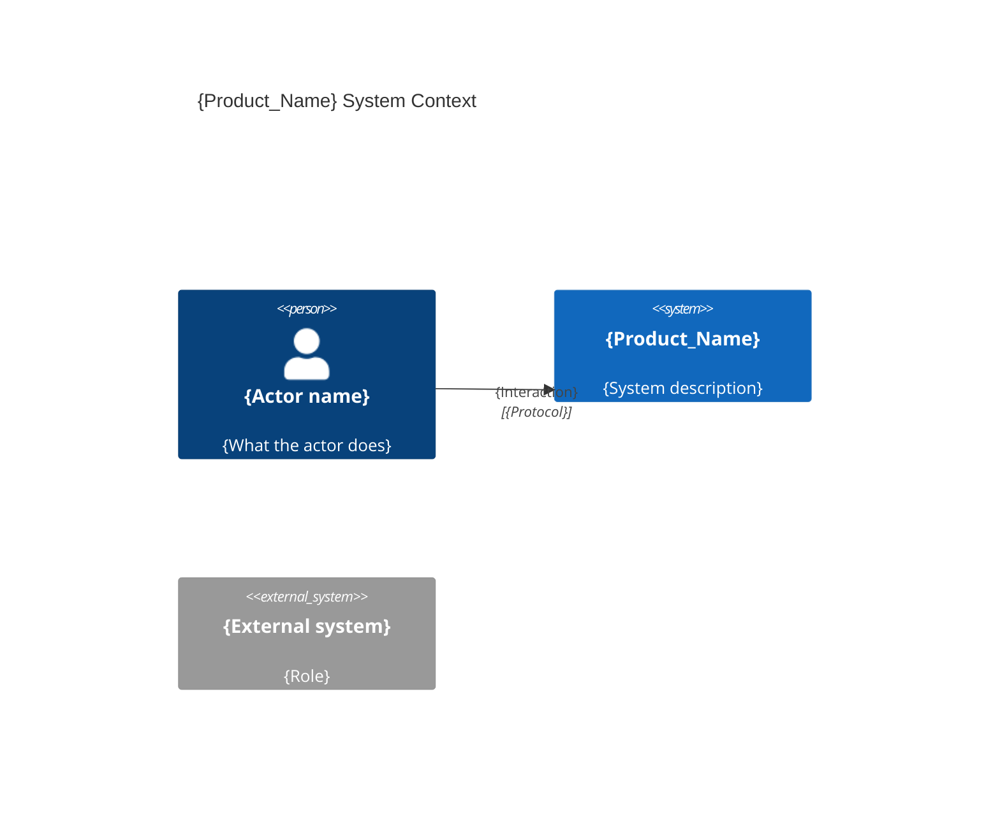

# System Architecture — {Product_Name}

## Overview

{One paragraph: what the system does, key capabilities, and target users.}

## C4 Diagram — System Context



## C4 Diagram — Containers

```mermaid
C4Container
  title {Product_Name} Containers

  Person({actor_id}, "{Actor name}")

  Container_Boundary({system_id}, "{Product_Name}") {
    Container({container_id}, "{Container name}", "{Technology}", "{Responsibility summary}")
  }

  Rel({actor_id}, {container_id}, "{Interaction}", "{Protocol}")
  Rel({container_a}, {container_b}, "{Interaction}", "{Protocol}")
```

## Containers — Detail

### {Container name} (`{source_folder}/`)

- **Responsibility**: {What this container does.}
- **Technology**: {Framework, language, key libraries.}
- **Constraints**: {Hard constraints on this container.}

{Repeat for each container.}

## Inter-container communication

| Source | Target | Protocol | Contract |
|--------|--------|----------|----------|
| {Container A} | {Container B} | {Protocol} | {Contract summary} |
