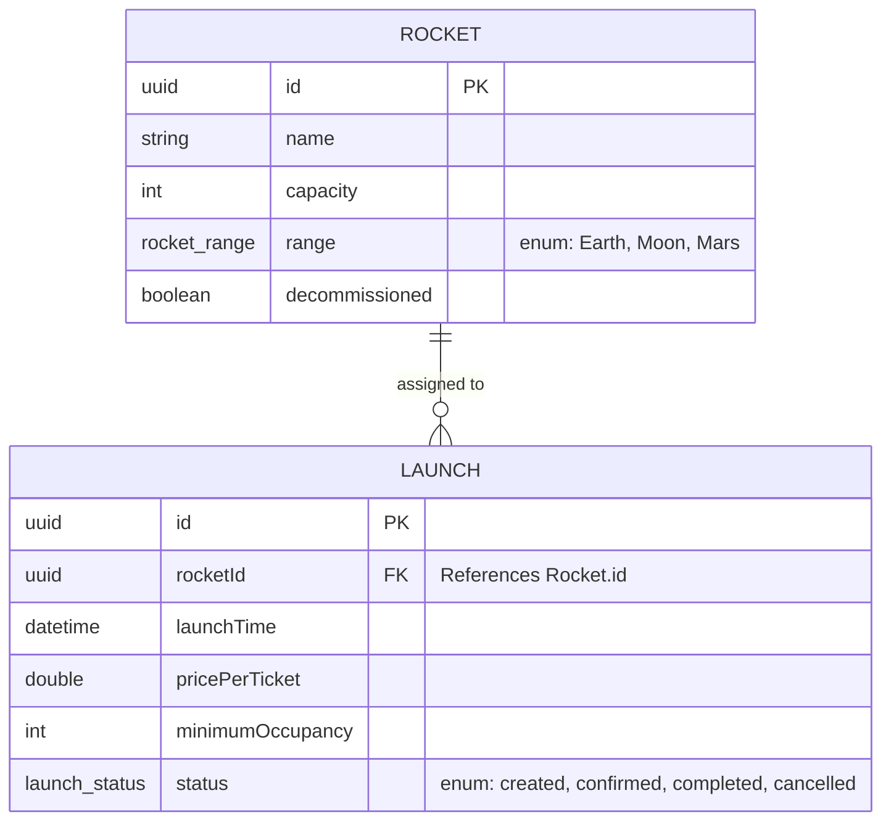

# Domain Model (E-R) — AstroBookings

## Overview

The AstroBookings domain model revolves around managing a fleet of rockets and scheduling launches for them. Entities are currently defined as Java classes in the backend and represented as JSON objects in the frontend. The system uses in-memory storage for the MVP phase.

## E-R Diagram

## Entities — Detail

### Rocket

| Field | Type | Constraints |
|-------|------|-------------|
| `id` | UUID | PK, Generated by Repository |
| `name` | String | Required |
| `capacity` | int | Required, > 0 |
| `range` | RocketRange | Enum: Earth, Moon, Mars |
| `decommissioned` | boolean | Defaults to false |

### Launch

| Field | Type | Constraints |
|-------|------|-------------|
| `id` | UUID | PK, Generated by Repository |
| `rocketId` | UUID | FK → Rocket.id |
| `launchTime` | LocalDateTime | Required |
| `pricePerTicket` | double | Required |
| `minimumOccupancy` | int | Required |
| `status` | LaunchStatus | Enum: created, confirmed, completed, cancelled |

## Relationships and integrity rules

| Relationship | Cardinality | Integrity rule |
|-------------|-------------|----------------|
| Rocket → Launch | 1:N via `rocketId` | A launch must be assigned to a valid rocket. |

## Cross-entity business rules

- **Cancellation Constraint**: A cancelled launch cannot be updated (enforced in `LaunchService`).
- **Initial Status**: New launches always start with the `created` status.
- **Decommissioning**: Rockets can be marked as `decommissioned`, which should ideally prevent them from being assigned to new launches (implicit rule, needs verification in code).
