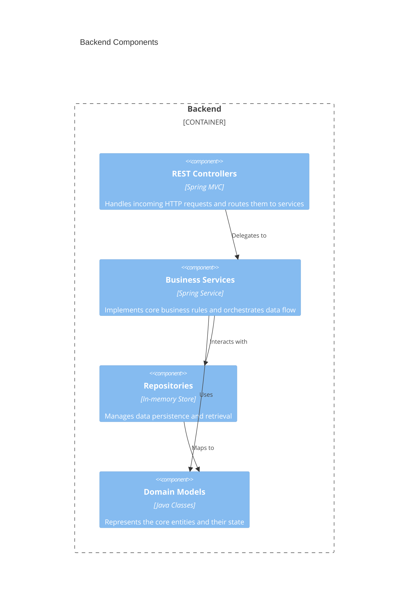
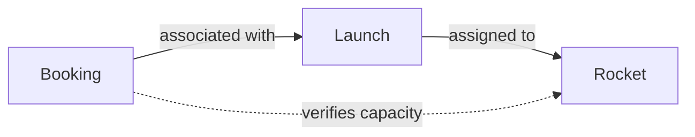

# Backend Architecture — AstroBookings

## Overview

The Backend tier is a REST API built with Spring Boot 3.5.0 and Java 21. It manages the business logic for rocket fleet management, launch scheduling, and passenger bookings. It provides a secure and structured way to interact with the system's data.

## C4 Diagram — Components



## Code organization

**Pattern**: Layer-based. The code is organized into packages based on their technical role in the application.

```text
back/src/main/java/academy/aicode/astrobookings/
├── controller/    # REST API endpoints
├── service/       # Business logic implementation
├── repository/    # Data access layer (In-memory)
├── model/         # Domain entities and enums
└── AstrobookingsApplication.java # Entry point
```

**New code must follow this pattern**: Add new functionality by creating a Controller for the API, a Service for the logic, a Repository for data, and Model classes for entities.

## Shared artifacts

| Path | Purpose |
|------|---------|
| N/A | No dedicated shared folder currently exists. Common logic is handled within the service layer. |

## Key contracts

| Endpoint | Method | Responsibility |
|----------|--------|----------------|
| `/rockets` | GET | List all rockets |
| `/rockets` | POST | Create a new rocket |
| `/rockets/{id}` | GET | Get rocket details |
| `/rockets/{id}` | PUT | Update rocket details |
| `/rockets/{id}` | DELETE | Decommission a rocket |
| `/launches` | GET | List all launches |
| `/launches` | POST | Plan a new launch |
| `/launches/{id}` | GET | Get launch details |
| `/launches/{id}` | PUT | Update launch details |
| `/bookings` | GET | List all bookings |
| `/bookings` | POST | Create a new booking |
| `/bookings/{id}` | GET | Get booking details |
| `/bookings/{id}` | PATCH | Cancel a booking |
| `/health` | GET | Check system health status |

## Dependencies between domains



- **Launch Service** depends on **Rocket Service** to verify rocket availability and capacity when planning launches.
- **Booking Service** depends on **Launch Service** and **Rocket Service** to ensure that bookings are made for valid launches and that the rocket capacity is not exceeded.

## Constraints

- **In-Memory Only**: Data must be stored in repositories using thread-safe collections (e.g., `ConcurrentHashMap`) until a persistent DB is integrated.
- **REST Compliance**: All API endpoints should follow standard RESTful conventions.
