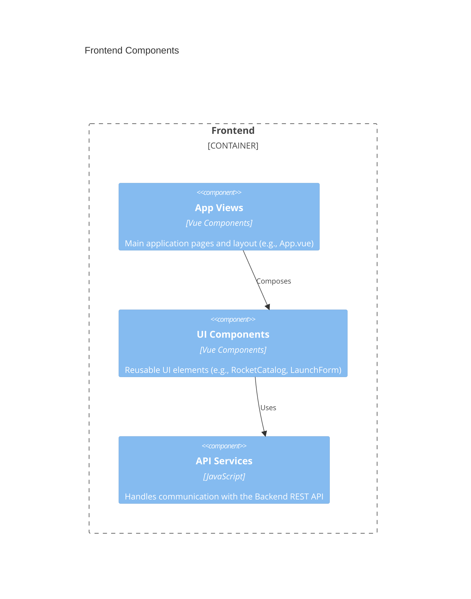
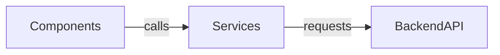

# Frontend Architecture — AstroBookings

## Overview

The Frontend tier is a Single Page Application (SPA) built with Vue 3. It provides a responsive and interactive user interface for managing rockets and launches. It communicates with the Backend REST API via standard HTTP calls.

## C4 Diagram — Components



## Code organization

**Pattern**: Hybrid. Folders are organized by technical role (components, services, assets) which contain feature-related files.

```text
front/astro-bookings/src/
├── assets/        # Static assets like images and global CSS
├── components/    # Vue components (RocketCatalog, LaunchForm, etc.)
├── services/      # API communication logic (rocketService.js, launchService.js)
├── App.vue        # Root component
└── main.js        # Application entry point
```

**New code must follow this pattern**: New features should add components to the `components/` folder and corresponding API logic to the `services/` folder.

## Shared artifacts

| Path | Purpose |
|------|---------|
| `src/assets/` | Shared styles and images. |
| `src/components/LaunchStatusBadge.vue` | Reusable UI component for displaying launch status. |
| `src/components/BookingStatusBadge.vue` | Reusable UI component for displaying booking status. |

## Key contracts

The Frontend consumes the Backend REST API. Key service functions include:

| Service | Function | Backend Endpoint |
|---------|----------|------------------|
| `rocketService` | `getAllRockets` | `GET /rockets` |
| `rocketService` | `createRocket` | `POST /rockets` |
| `launchService` | `getAllLaunches` | `GET /launches` |
| `launchService` | `createLaunch` | `POST /launches` |
| `bookingService` | `getAllBookings` | `GET /bookings` |
| `bookingService` | `createBooking` | `POST /bookings` |
| `bookingService` | `cancelBooking` | `PATCH /bookings/{id}` |
| `healthService` | `getHealth` | `GET /health` |

## Dependencies between domains



- **Components** rely on **Services** to fetch and send data.
- **Services** are decoupled from UI logic, focusing only on HTTP communication.

## Constraints

- **Single Source of Truth**: All data must be fetched from the Backend API; no local state should persist across sessions without being synced to the backend.
- **Component Isolation**: Components should be as self-contained as possible, using props and events for communication.
