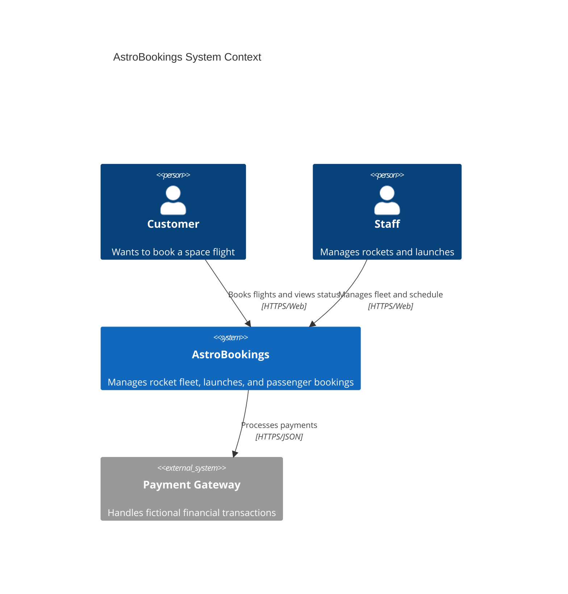
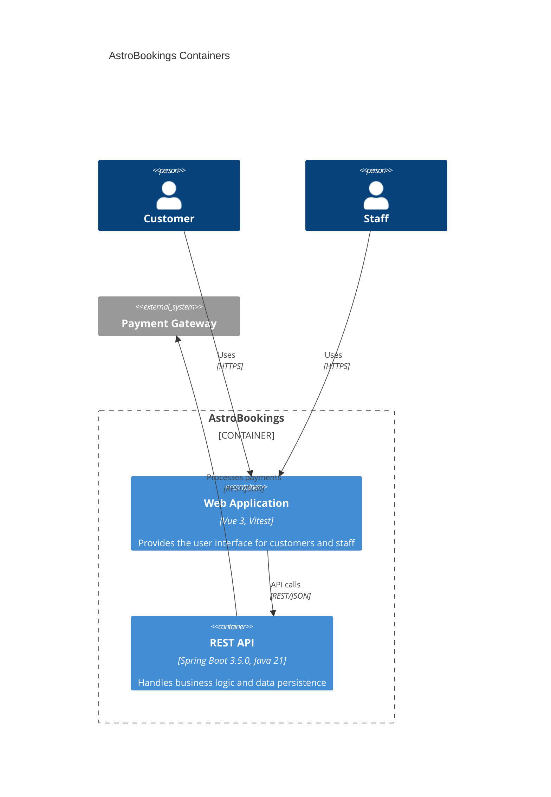

# System Architecture — AstroBookings

## Overview

AstroBookings is a space tourism management system that allows customers to book orbital and lunar launches, and enables company staff to manage the rocket fleet and launch schedules. It is a brownfield project being evolved into a robust REST API with a modern web frontend.

## C4 Diagram — System Context

## C4 Diagram — Containers

## Containers — Detail

### Web Application (`front/astro-bookings/`)

- **Responsibility**: Provides the user interface for both customers (booking launches) and staff (managing the rocket fleet).
- **Technology**: Vue 3, Vitest for testing.
- **Constraints**: Must be responsive and communicate exclusively with the Backend API.

### REST API (`back/`)

- **Responsibility**: Implements the core business logic for fleet management, launch planning, and booking.
- **Technology**: Spring Boot 3.5.0, Java 21.
- **Constraints**: Currently uses in-memory storage (ConcurrentHashMap) as part of the MVP phase.

## Inter-container communication

| Source | Target | Protocol | Contract |
|--------|--------|----------|----------|
| Web Application | REST API | REST/JSON | Domain-specific endpoints (e.g., /api/rockets, /api/launches) |
| REST API | Payment Gateway | REST/JSON | Fictional payment processing contract |
