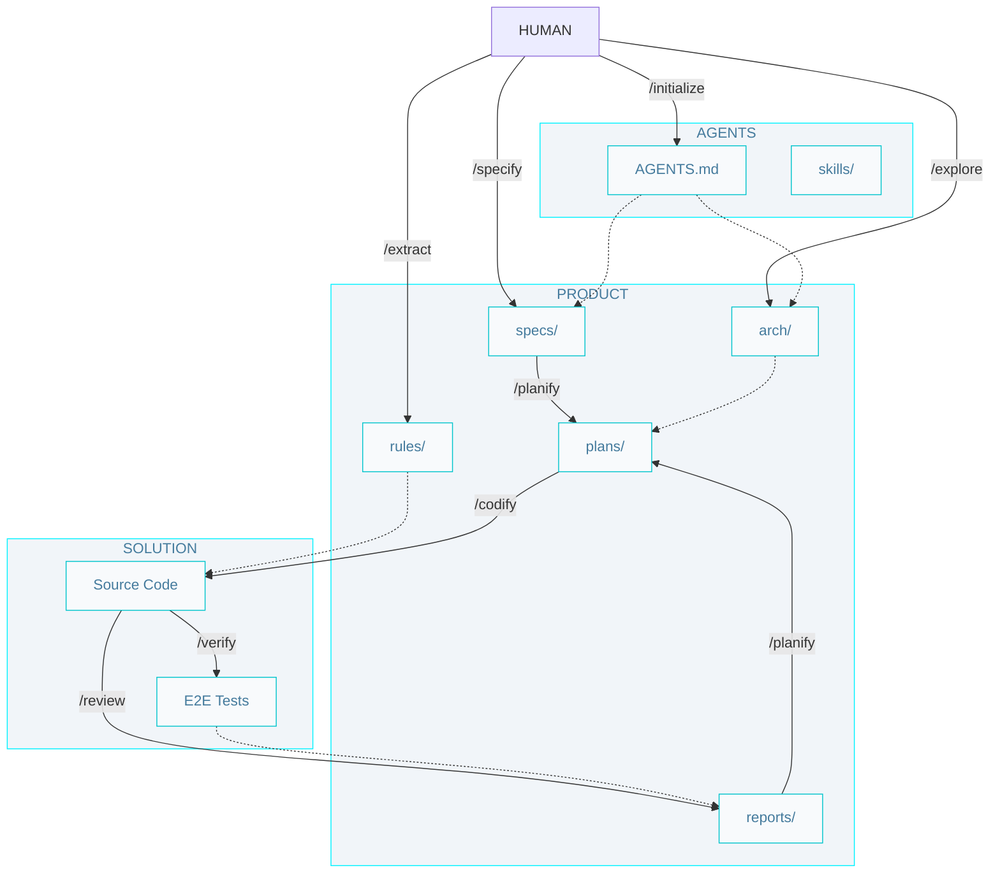

# AIDD Workflow

## Commands

- `/initialize` - Create initial technology documentation (AGENTS.md and skills/) for a project.

- `/explore` - Reverse-engineer an existing codebase to discover its architecture and infer the ADRs. 

- `/extract` - Extract coding rules from an existing codebase.

- `/specify` - Create a new specification from a requirement (defines problem, solution, and verification).

- `/planify` - Create a set of implementation plans for a specification or bug-fix (back, front, and data).

- `/codify` - Writes the code and unit tests following a plan, or a minor requirement.

- `/verify` - Run end-to-end tests to ensure code meets specifications.

- `/review` - Review code for guideline compliance and best practices.

## Artifacts

### Technology

- `AGENTS.md` - The entry point for any agent joining the project, with product and technology information.

- `skills/` - Teach your agent how to do things. Make them easy to know when to use.

### Product

- `arch/` - Architecture documentation with system and tier-level diagrams and inferred ADRs. 

- `rules/` - Define rules that agents must follow when writing code. Can be linked to agents' custom folder.

- `specs/{slug}.spec.md` - A detailed specification (problem, solution, verification) of a feature or technical requirement.

- `plans/{slug}.{source?}.{tier?}.plan.md` - A set of implementation plans derived from a single specification, or a report of a bug-fix.

- `reports/{slug}.report.md` - A report generated during the review process, such as accessibility and compliance reports.

### Solution

- `Source Code` - The implementation of the system, including unit tests.

- `E2E Tests` - End-to-end tests that verify the implemented code meets the defined specifications and acceptance criteria.